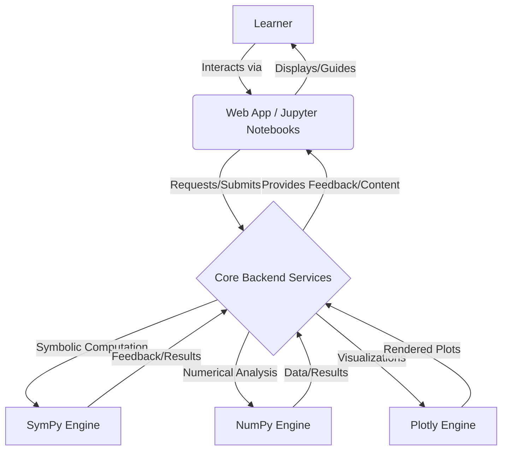

# Foundational Calculus Learning Module

This repository houses the `CalculusFoundationsLab`, a comprehensive, interactive learning module designed to provide a strong conceptual and computational understanding of single-variable and introductory multi-variable Calculus. It leverages Python for powerful symbolic computation, numerical analysis, and interactive visualizations to create an engaging "learn by doing" experience.

## Architecture Overview

The platform is designed as a hybrid interactive learning environment, primarily using Python for its core logic and interactive elements. It can be deployed as interactive Jupyter Notebooks or as a lightweight web application.



## Concepts Covered

This module provides a foundational understanding across three key areas of calculus:

### Part 1: Differential Calculus (Calculus 1 equivalent)
*   **Pre-Calculus Support:** Active diagnostics and just-in-time refreshers for functions, graphing, basic algebra, and trigonometry.
*   **Limits and Continuity:** Graphical and algebraic understanding, properties, infinite limits.
*   **Derivatives:** Definition, differentiation rules (power, product, quotient, chain), trigonometric, exponential, and logarithmic functions.
*   **Applications of Derivatives:** Related rates, optimization, curve sketching, L'Hopital's Rule.

### Part 2: Integral Calculus (Calculus 2 equivalent)
*   **Antiderivatives and Indefinite Integrals:** Concept and basic rules.
*   **Definite Integrals:** Riemann sums, Fundamental Theorem of Calculus, properties.
*   **Applications of Integrals:** Area between curves, volume of solids of revolution.
*   **Techniques of Integration (Introduction):** Substitution, integration by parts (basic).

### Part 3: Sequences, Series, and Introduction to Multivariable Calculus (Calculus 3 conceptual intro)
*   **Sequences and Series (Introduction):** Conceptual understanding of convergence/divergence, Taylor series.
*   **Vectors and Curves in Space (Conceptual):** 3D coordinates, vectors, basic curves.
*   **Partial Derivatives (Conceptual):** Idea of derivatives for functions of multiple variables.

## How to Run

The `CalculusFoundationsLab` can be explored via interactive Jupyter notebooks or, if implemented, a web application.

1.  **Clone the Repository:**
    ```bash
    git clone https://github.com/aastom/CalculusFoundationsLab.git
    cd CalculusFoundationsLab
    ```
2.  **Set up Python Environment:**
    It is highly recommended to use a virtual environment.
    ```bash
    python -m venv venv
    source venv/bin/activate  # On Windows use `venv\Scripts\activate`
    pip install -r requirements.txt
    ```
3.  **Explore Jupyter Notebooks:**
    Navigate to the `notebooks/` directory and start Jupyter Lab or Jupyter Notebook.
    ```bash
    jupyter lab
    ```
    Open the `.ipynb` files to follow guided lessons and interact with the modules.

## References

*   **SymPy:** A Python library for symbolic mathematics.
*   **NumPy:** The fundamental package for numerical computing with Python.
*   **Plotly:** An interactive graphing library for Python.
*   **Jupyter:** Web-based interactive computing notebooks.
