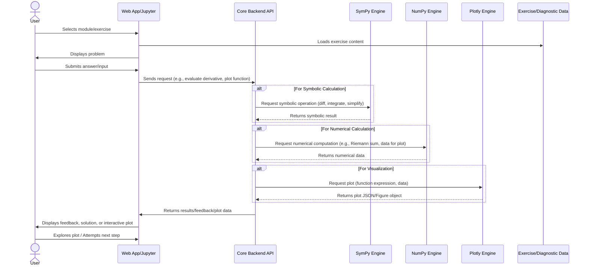

# System Architecture for CalculusFoundationsLab

This document details the technical architecture of the `CalculusFoundationsLab`, an interactive learning module for foundational calculus. The design prioritizes flexibility, interactivity, and robust computational capabilities.

## Overview

The `CalculusFoundationsLab` employs a hybrid architecture, primarily built on Python, to provide a versatile learning environment. It can manifest as a collection of interactive Jupyter Notebooks for self-guided exploration or be integrated into a lightweight web application for a more structured user experience. The core strength lies in its ability to perform symbolic calculations, numerical approximations, and generate dynamic visualizations.

## Component Breakdown and Data Flow

### Core Backend (Python)
This layer is the computational heart of the module, encompassing:

*   **Symbolic Computation Engine (SymPy):** Handles all symbolic mathematical operations such as differentiation, integration, limits, equation solving, and expression simplification. It is crucial for evaluating user inputs in exercises and generating accurate solutions.
*   **Numerical Computation Engine (NumPy):** Used for efficient array operations, numerical approximations (e.g., Riemann sums), and generating data points for visualizations.
*   **Visualization Engine (Plotly):** Provides an API for creating interactive 2D and 3D graphs and animations, essential for building an intuitive understanding of calculus concepts.

### Interactive Learning Environment

*   **Jupyter Notebooks:** Offer a direct, hands-on environment where learners can execute code, modify parameters, and observe immediate results. This is ideal for guided derivations and problem-solving. Notebooks integrate directly with the core Python backend.
*   **Optional Web Application (FastAPI/Frontend):** A lightweight web application can provide a more polished user interface, structured navigation, and centralized access to exercises and modules. It would interact with the Python backend via a RESTful API.

### Diagnostic & Feedback Engine
This integrated logic evaluates pre-calculus readiness and provides specific, actionable feedback on calculus exercises. It leverages SymPy for nuanced symbolic comparisons and error analysis, aiming to diagnose common mistakes rather than just marking answers as right or wrong.

## Key Technology Choices

*   **Python:** The primary programming language due to its rich ecosystem for scientific computing and web development.
*   **SymPy:** Chosen for its comprehensive symbolic mathematics capabilities, crucial for accurate calculus operations and intelligent feedback.
*   **NumPy:** Essential for high-performance numerical operations and data array manipulation.
*   **Plotly:** Selected for generating interactive and visually engaging 2D and 3D graphics, supporting conceptual understanding.
*   **Jupyter Notebooks:** Provides an excellent interactive, executable learning environment.
*   **(Optional) FastAPI:** A modern, fast (high-performance) web framework for building APIs, suitable for a lightweight web application backend.

## Technical Constraints Addressed

1.  **Computational Accuracy:** Rigorous testing of SymPy wrappers to ensure correctness.
2.  **Interactivity & Performance:** Optimization strategies for visualizations and calculations to maintain responsiveness.
3.  **Ease of Deployment:** Support for local execution, cloud-based notebooks (Binder/Colab), and potential Dockerized web app deployment.
4.  **Content Scalability:** Modular code design facilitates easy addition of new topics and exercises.
5.  **Open Source & Maintainability:** Exclusive use of open-source libraries and adherence to Python best practices.
6.  **Effective "Proof Avoidance":** Visualizations and interactive steps are crafted to intuitively explain concepts without formal proofs.
7.  **Granular Feedback:** SymPy's capabilities are leveraged for nuanced error analysis in exercise feedback.
8.  **Seamless Pre-Calculus Integration:** Diagnostic tools and just-in-time remediation are designed to be contextually embedded within the calculus modules.
